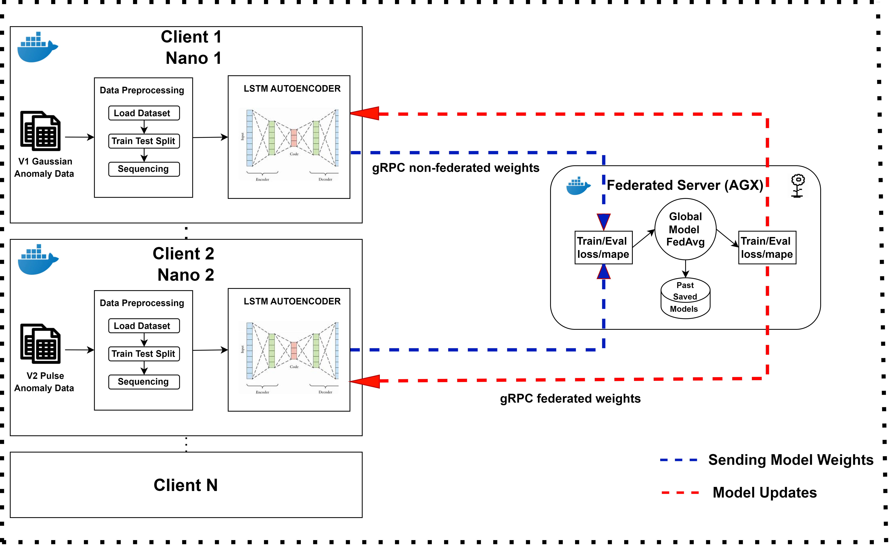
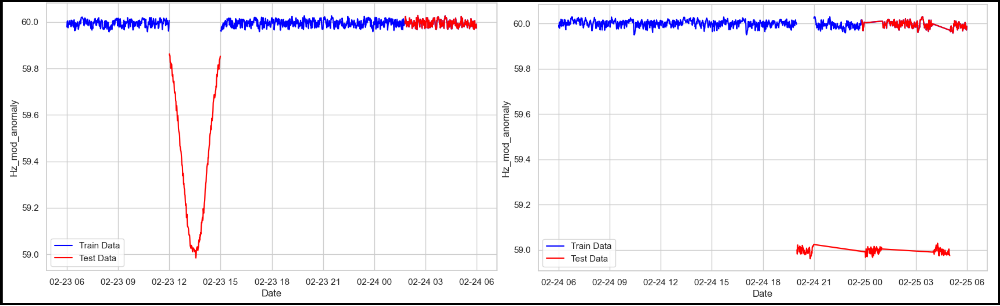

# Federated Learning for Anomaly Detection in Distributed Energy Resources (DERs)
# Branch: HFL
# Purpose: Hierarchical Federated Learning experiments

## Fed Learning Project with Flower (flwr) Client and Server.
<div align="center">
  
</div>


This repository contains the code, datasets, and documentation for our research paper titled **"Federated Edge Learning (FEL) TestBed for Anomaly Detection in DERs."** This study explores the application of Federated Learning (FL) in a distributed energy resource (DER) environment, with a focus on anomaly detection using NVIDIA Jetson devices.

The repository demonstrates Federated Learning-based anomaly detection in a DER environment using the Flower framework. The project specifically employs Long Short-Term Memory (LSTM) autoencoders to detect anomalies related to False Data Injection Attacks (FDIAs). The deployment is managed using Docker containers, the base image used is Nvidia l4t containers with GPU processing enabled. Final images can be found at:

- [hamzakarim07/flwr_client](https://hub.docker.com/repositories/hamzakarim07)
- [hamzakarim07/flwr_server](https://hub.docker.com/repositories/hamzakarim07)

<div align="center">
  
</div>

### Dataset Split for Train-Test:
The dataset was split in order that 80% of normal instances were considered for training and rest 20% and all the anomalous data points were used as testing data.
<div align="center">
  
</div>

### How to Run:

#### Prerequisites:
1. NVIDIA Jetson devices (e.g., Jetson AGX Orin, Jetson Nano)
2. Docker installed on the devices

#### Setup Federated Server:
1. Build the docker image:
   ```bash
   docker build --platform linux/arm64 -t hamzakarim07/flwr_server:latest -f FL_server/docker/Dockerfile .
   ```
2. Pull the Docker image for the server on the Jetson Nano device from [Docker Hub](https://hub.docker.com/repositories/hamzakarim07):
   ```bash
   sudo docker pull hamzakarim07/flwr_server:latest
3. Run following command to run docker container:
   ```bash
   sudo docker run -d --name flwr-server --runtime=nvidia --gpus all -e NVIDIA_VISIBLE_DEVICES=all -p 8080:8080 hamzakarim07/flwr_server:latest
4. Go inside the docker container:
   ```bash
   sudo docker exec -it <container_id_or_name> bash
   cd src
5. Run python command to execute the python script:
   ```bash
   python3 server_LSTM_2.py
   
#### Setup Federated Clients:
1. Build the docker image:
   ```bash
   docker build --platform linux/arm64 -t hamzakarim07/flwr_client:latest -f FL_client/docker/Dockerfile .
   ```
2. Pull the Docker image for the client on the Jetson Nano device from [Docker Hub](https://hub.docker.com/repositories/hamzakarim07):
   ```bash
   sudo docker pull hamzakarim07/flwr_client:latest
3. Run following command to run docker container for client 1, just change the name of container for client 2:
   ```bash
   sudo docker run -d --name flwr-client1 --runtime=nvidia --gpus all -e NVIDIA_VISIBLE_DEVICES=all hamzakarim07/flwr_client:latest
4. Go inside the docker container:
   ```bash
   sudo docker exec -it <container_id_or_name> bash
   cd src
5. Run python command to execute the python script for client 1 and 2 **--ip is server ip**:
   ```bash
   python3 client_LSTM_2.py --ip=192.168.1.24 --folder=Client_1_LSTM --id=1
   python3 client_LSTM_2.py --ip=192.168.1.24 --folder=Client_22_LSTM --id=2
   
### Some Random Docker commands
1. To build docker images from the repository, first pull the repo and then execute the following commands:
   ```bash
   sudo docker build -t hamzakarim07/flwr_client:latest -f FL_client/docker/Dockerfile .
   sudo docker build -t hamzakarim07/flwr_server:latest -f FL_server/docker/Dockerfile .
   sudo docker login
   sudo docker push hamzakarim07/flwr_server:latest
   sudo nano /root/.docker/config.json

2. Docker config file should be like below to use --runtime = nvidia :
   ```bash
       sudo nano /etc/docker/daemon.json
   
       {
        "default-runtime": "nvidia",
        "runtimes": {
            "nvidia": {
                "args": [],
                "path": "nvidia-container-runtime"
            }
        }
    }

3. If docker is removed or docker engine not working:
   ```bash
   sudo apt-get remove --purge docker docker.io containerd runc
   sudo apt-get update
   sudo apt-get install docker.io
   sudo systemctl start docker
   sudo systemctl enable docker
   sudo docker run hello-world

4. Setup Portainer for Managing Docker Containers:
   ```bash
   docker run -d -p 8000:8000 -p 9443:9443 --name portainer --restart=always -v /var/run/docker.sock:/var/run/docker.sock -v portainer_data:/data portainer/portainer-ce:latest
   Portainer Web Interface: https://IP:9443

   
### Run Random Forest code
    ```bash
    sudo docker-compose up -d 
    python client_rf.py --ip=172.16.232.50 --folder=Client_1 --id=1

## How I trained NFL using jupyter lab on nano and agx using nvidia l4t-ml container.

1. ssh into device and run the command:
   ```bash
   sudo docker run -it --rm --runtime nvidia --network host nvcr.io/nvidia/l4t-ml:r36.2.0-py3
   sudo docker run -it --rm --runtime nvidia --network host --name your_container_name nvcr.io/nvidia/l4t-ml:r36.2.0-py3

2. ssh again to fwd port 9999 from local machine (nano 6) :
   ```bash
   ssh -L 9999:localhost:8888 c2srnano06@172.16.233.149 -p 16
3. Then open URL from local machine:
   ```bash
   http://localhost:9999

## Acknowledgments
I would like to acknowledge NVIDIA for providing the L4T base images used in this project. The L4T (Linux for Tegra) container images were instrumental in enabling GPU-accelerated machine learning tasks on NVIDIA Jetson devices.

